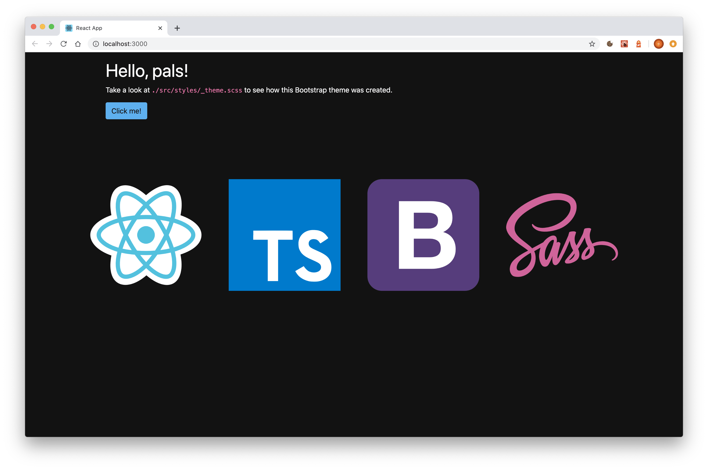

# cra-template-ts-bootstrap

This is a fork of the [official TypeScript template](https://github.com/facebook/create-react-app/tree/master/packages/cra-template-typescript) for [Create React App](https://github.com/facebook/create-react-app), but doesn't come with the placeholder React logo. So you don't have to clean up your new project  before you are able to start coding.

To use this template, add `--template ts-bootstrap` when creating a new app.

For example:

```sh
npx create-react-app my-app --template ts-bootstrap

# or

yarn create react-app my-app --template ts-bootstrap
```



For more information, please refer to:

- [Getting Started](https://create-react-app.dev/docs/getting-started) – How to create a new app.
- [User Guide](https://create-react-app.dev) – How to develop apps bootstrapped with Create React App.

If you find this useful, you might also like my other projects: [https://lgk.io](https://lgk.io)\
My Twitter: [@lgkonline](https://twitter.com/lgkonline)